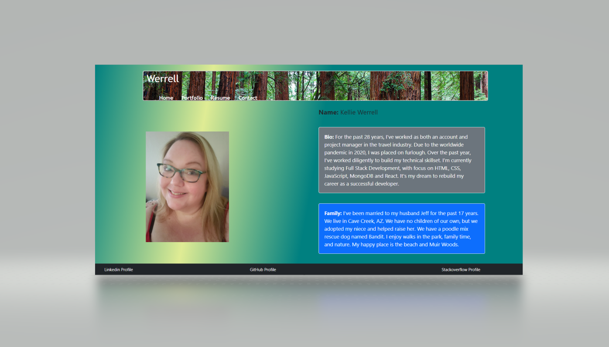
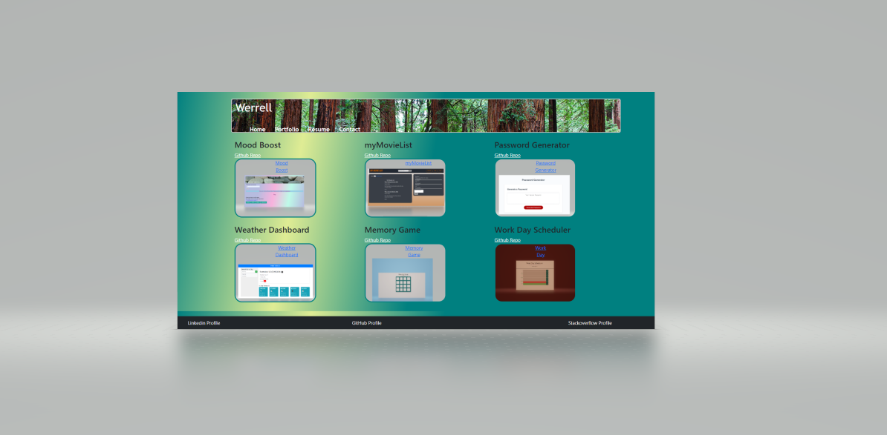
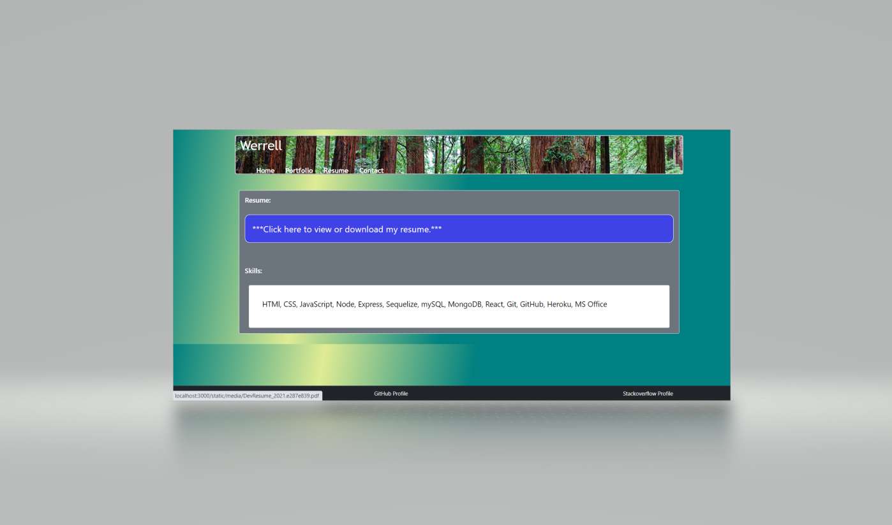
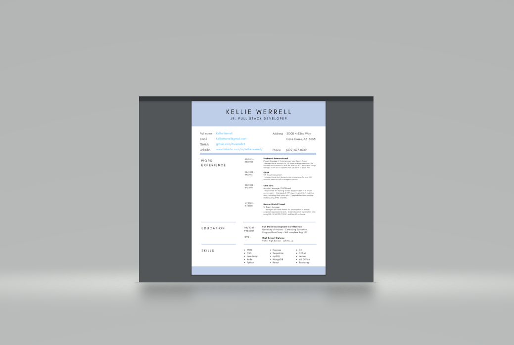
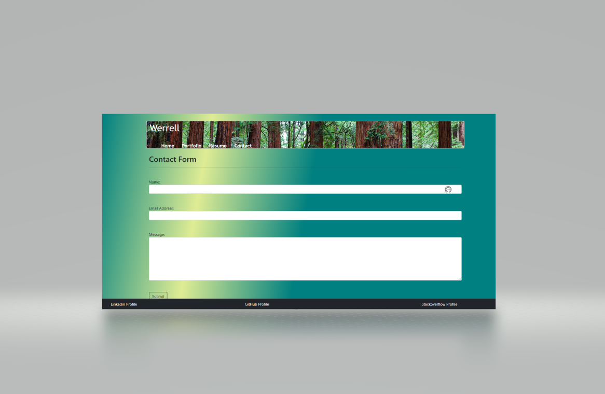

# Portfolio

## Description
🔍 Developer portfolio created with React as a single page application.  

    

## Built With

    
    
    
    
    
   
   

   
    

## User Story
As an employer looking for candidates with experience building single-page applications
I WANT to view a potential employee's deployed React portfolio of work samples
SO THAT I can assess whether they're a good candidate for an open position

 
  

## Table of Contents
- [Description](#description)
- [Built With](#built-with)
- [User Story](#user-story)
- [Table of Contents](#table-of-contents)
- [Deployment](#deployment)
- [Screenshots](#screenshots)
- [Contribution](#contribution)
- [Questions](#questions)

 

## Deployment
https://infinite-falls-12185.herokuapp.com/

 

## Screenshots

## Contribution
:star: This application was created by Kellie Werrell.

 

## Questions
:telephone_receiver: Contact me with any questions: [email](mailto:kelliewerrell@gmail.com) , [GitHub](https://github.com/Kwerrell73) 